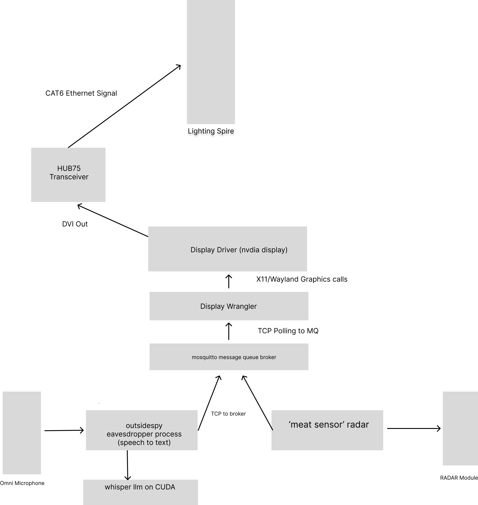

# Outside Voice


Wandering through deep playa - you find a confidante lounge with an spire showing animations on 98,304 LEDs, and a microphone. What could it mean?

Outside Voice is a deep playa art installation and lounge space for 2024. It makes use several of the SDKs we distribute:

Human detecting RADAR - unphased by darkness and dust
Our graphics generator for use with HUB75 LED displays
Our prebuilt binaries for limited off-grid speech recognition
Support us through our fundraiser, or through donating code through Github. We are a 401(3)c nonprofit - donations may be tax deductible, and your time may qualify for your employer's volunteer programs. All source and hardware is open sourced - feel free to use for any noncommerical purposes or to accelerate the rise of the machines.




# Running Locally

You will need to install mosquitto and the mosquitto clients. On a Mac, you can do this with `brew install mosquitto`.
Most Linux instructions are available at https://mosquitto.org/download/

For this engine - create  a virtual environment and install the requirements:

```bash
python3 -m venv venv
source venv/bin/activate
pip install -r requirements.txt
```

It does use X11/Wayland - so you will need to have a display available. If you are running on a headless server, you can use Xvfb:

# Contributing

We are looking for help with the following:
    - graphics and prettiness
    - using the information from the radar to make the display more interesting
    - using the speech recognition to customize the display according to what is being said in a creepy way

